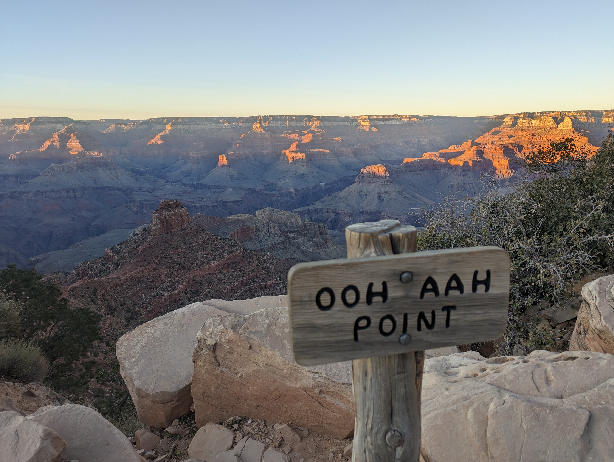

# OCR API

This repository houses a very simple OCR API leveraging PaddleOCR to perform optical character recognition on your image of choice.

Simply make a GET request to `/infer?url=<image_address>` to have any text in the image returned.

Here, click this [link](https://github.com/benjibuiltit/ocr-api/raw/main/oohaah.jpg) to try it out for this photo I took at Ooh Aah Point in Grand Canyon National Park.

